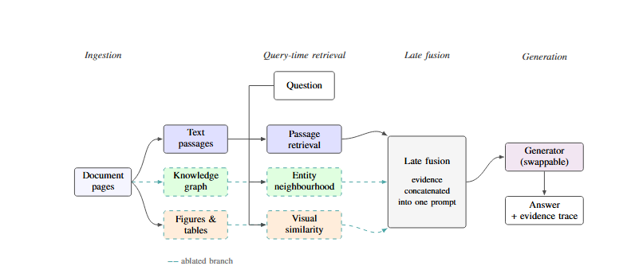

# Multimodal and Graph-Aware RAG

This repository implements and evaluates retrieval-augmented generation systems
for scientific document question answering. It uses the Hugging Face
`lhoestq/small-publaynet-wds` dataset to compare text-only retrieval,
knowledge-graph augmentation, multimodal retrieval, and their combination.

A detailed report covering the problem formulation, data preprocessing,
experimental design, and results is available in `report.pdf`.

## Architecture

<p align="center">
  
</p>

The pipeline processes document pages into text passages, a knowledge graph,
and figure or table crops. At query time, the three evidence sources are
retrieved independently and combined through late fusion before generation.
The knowledge-graph and visual branches can be enabled or removed to support
controlled ablation across system configurations.

## Systems evaluated

The main experiment compares four systems:

* `baseline`: text-only RAG
* `+KG`: text retrieval enhanced with knowledge-graph facts
* `+multimodal`: text retrieval enhanced with CLIP-retrieved figures and tables
* `+both`: text retrieval combined with knowledge-graph and multimodal evidence

## Project structure

```text
.
├── ingestion.py
├── rag_basics.py
├── rag_full.py
├── rag_multimodal.py
├── rag_vlm.py
├── graph_aware.py
├── compare_all.py
├── compare_graph_vs_basaline.py
├── compare_multimodal.py
├── evaluation.py
├── metrics.py
├── explainability.py
├── generate_figure_questions.py
├── generate_questions_multihop.py
├── generate_questions_publaynet.py
├── questions_publaynet_text.json
├── questions_publaynet_figures.json
├── questions_publaynet_multihop.json
├── requirements.txt
├── environment.yml
└── results/
```

## Dataset

The project streams pages from:

```text
lhoestq/small-publaynet-wds
```

The ingestion stage creates:

```text
publaynet_corpus/
```

for extracted text, and:

```text
publaynet_images/
```

for cropped figures and tables.

These generated directories are excluded from GitHub.

## Installation

Create the Conda environment:

```bash
conda env create -f environment.yml
conda activate rag
```

Alternatively, install the Python dependencies directly:

```bash
pip install -r requirements.txt
```

## Environment variables

Create a `.env` file in the project root:

```text
OPENAI_API_KEY=your_api_key
```

The `.env` file is excluded from GitHub.

## Data ingestion

Process 100 pages from the dataset:

```bash
python ingestion.py --limit 100
```

For a smaller test run with additional output and without image caption generation:

```bash
python ingestion.py --limit 5 --smoke
```

The ingestion script performs OCR on textual regions and saves figures and tables for multimodal retrieval.

## Running the main comparison experiment

The main experiment is implemented in `compare_all.py`.

It builds the text index, knowledge graph and image index once, then evaluates all four systems on the selected question set.

### Text questions

```bash
python compare_all.py questions_publaynet_text.json
```

### Figure and table questions

```bash
python compare_all.py questions_publaynet_figures.json
```

### Multi-hop questions

```bash
python compare_all.py questions_publaynet_multihop.json
```

The experiment reports:

* Recall at K
* Mean Reciprocal Rank
* answer accuracy
* faithfulness
* answer relevancy

Summary and per-question CSV files are written to the `results/` directory.

## Running individual comparisons

Compare the baseline system with the knowledge-graph system:

```bash
python compare_graph_vs_basaline.py
```

Compare the text and multimodal systems:

```bash
python compare_multimodal.py
```

These scripts can be used when a full four-system comparison is not required.

## Metrics experiment

Run the standalone metrics experiment with:

```bash
python metrics.py
```

The metrics module evaluates retrieval and generated-answer quality using measures such as:

* Recall at K
* Mean Reciprocal Rank
* exact match
* token-level F1
* BLEU
* ROUGE-L
* BERTScore

The lexical and semantic metrics complement the language-model-based accuracy, faithfulness and relevancy judgements used by the main comparison experiment.

## Evaluation

Run the evaluation script with:

```bash
python evaluation.py
```

This evaluates generated answers against the expected answers and sources contained in the question datasets.

The question files use the following structure:

```json
{
  "q": "Question text",
  "source": "Expected source file",
  "answer": "Expected answer",
  "type": "text, figure or multihop"
}
```

## Explainability

The explainability functionality is implemented in:

```text
explainability.py
```

It is used to inspect why the system produced an answer by exposing the supporting evidence used during retrieval and generation.

Depending on the selected system, this evidence can include:

* retrieved text chunks
* source document names
* knowledge-graph facts
* retrieved figure or table names
* image captions
* similarity or retrieval scores
* the final context passed to the language model

This makes it possible to trace an answer back to the evidence retrieved from the corpus.

## Question generation

Generate text questions from the processed PubLayNet corpus:

```bash
python generate_questions_publaynet.py
```

Generate figure and table questions:

```bash
python generate_figure_questions.py
```

Generate multi-hop questions:

```bash
python generate_questions_multihop.py
```

The generated questions should be reviewed before they are used as evaluation ground truth.

## Running individual RAG systems

The individual implementations can also be run separately:

```bash
python rag_basics.py
python rag_full.py
python graph_aware.py
python rag_multimodal.py
python rag_vlm.py
```

These scripts support testing and inspecting each stage of the project independently.

## Results

Generated experiment outputs are stored in:

```text
results/
```

The main comparison produces:

* an aggregate summary CSV containing one row per system
* a detailed CSV containing results for every question and system

The result filenames include the question set and execution timestamp so that multiple runs can be retained.

## Recommended experiment order

```bash
python ingestion.py --limit 100
python compare_all.py questions_publaynet_text.json
python compare_all.py questions_publaynet_figures.json
python compare_all.py questions_publaynet_multihop.json
python metrics.py
```


